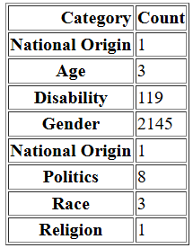

## Resources 
https://github.com/Sinhala-NLP/SOLD/tree/master

## Method :
Merge test and train data sets 
preprocess as notebook
Finalized dataset ->'Sinhala\data\processed_sold_dataset_v2.csv'

1. Identify the categories  
    - Use LLMs ✅ Done
    - Manual review ✅ Done
    -created separete category dataset -Done ->'Sinhala\data\offensive_words_categorized.csv'

Add steriotype -Done

Add category column to Fianlized dataset using  category dataset -Done

2. Identify most frequent category and identify the reasons
 
3. Unique words/categories for each language
4. EDA analysis

## Data
Columns   
- id  ( qunique int value ) 
- sentence/context 
- offensive or not (YES | NO)
- traget ( individual | group | untrageted )
    -  group => categories
- offensive token
- language

# Initial data structure 

